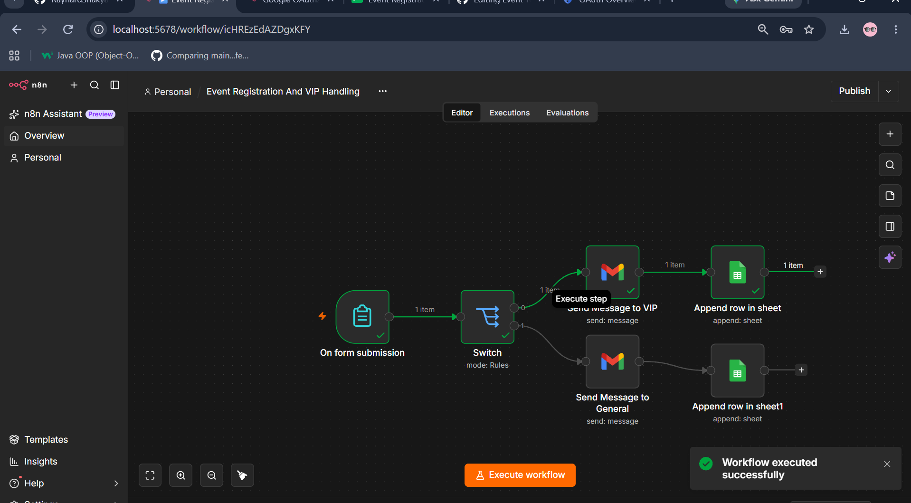
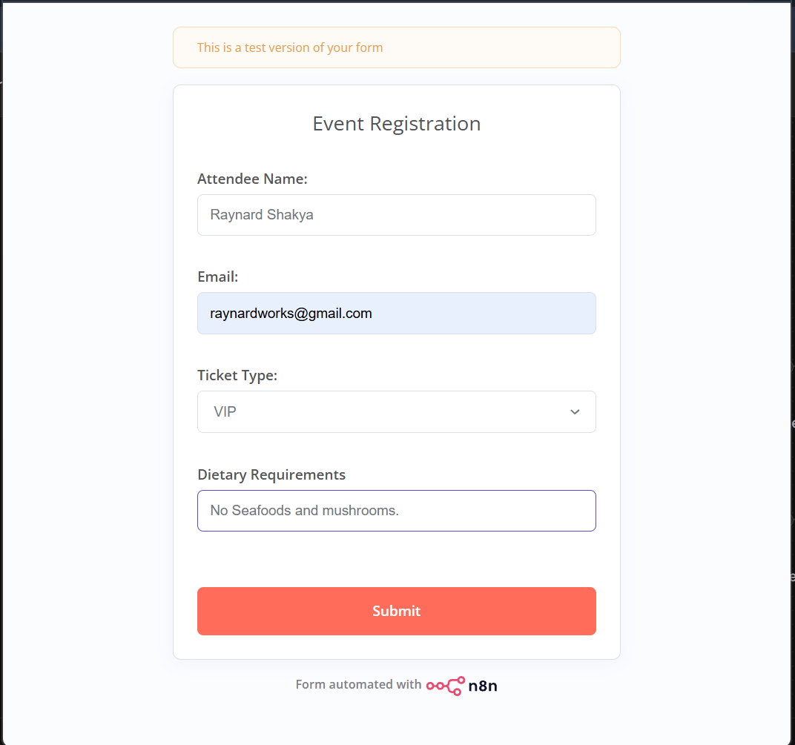
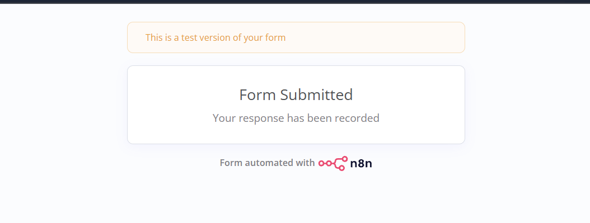
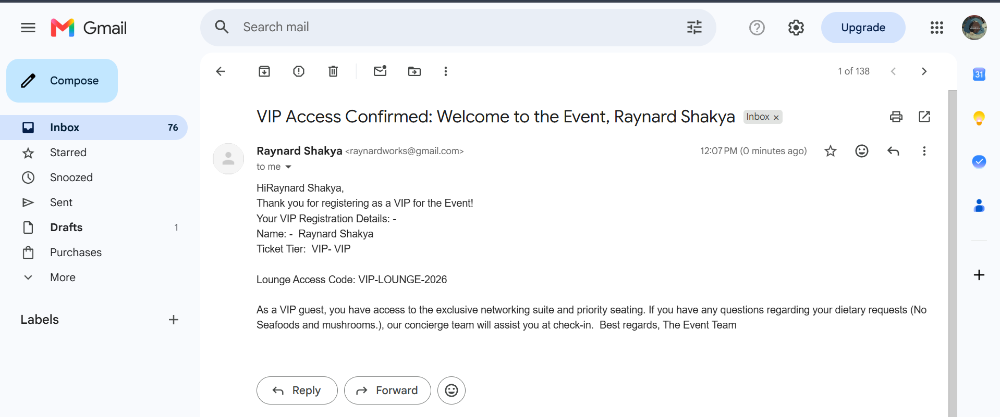
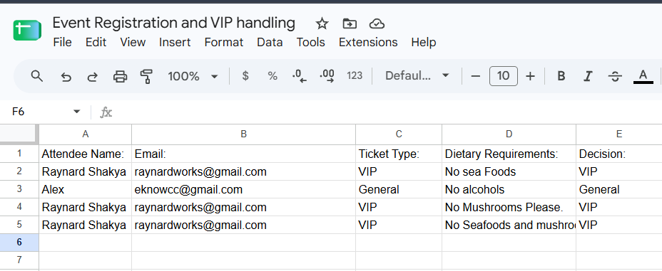

#  Event Registration & VIP Handling Automation

An end-to-end, event-driven automation workflow built with **n8n** that streamlines the entire attendee lifecycle—from initial form submission to VIP classification, automated ticketing, and real-time administrative notification.

---

##  Project Overview

Managing event registrations manually often leads to delayed response times, fragmented communication, and missed VIP handling. This project automates the entire backend process for event organizers:

* **Real-time Intake**: Captures form entries instantly upon user submission.
* **Smart Tier Routing**: Automatically scans submission data (e.g., ticket type, company role, invitation code, or spend) to flag and prioritize **VIP attendees**.
* **Personalized Communications**: Triggers tailored confirmation emails, event access details, and specialized VIP perks via Gmail.
* **Centralized Data Storage**: Maintains a single source of truth by logging attendee details into Google Sheets.
* **Organizer Alerts**: Instantly alerts event managers when a high-priority VIP registers.

---

##  Workflow Architecture & Node Breakdown

[ Form / Webhook ] -->

[ Google Sheets ] --> Log Registrant Data
-->
[ Switch Node ] -->(Evaluates VIP Status)
│
--> [ General Path ] --> Send Standard Confirmation Email
│
└--> [ VIP Path ]     --> Send VIP Access Pass Email
--> Notify Event Admin

### Key Components

| Node Name | Function / Purpose |
| :--- | :--- |
| **Webhook / Form Trigger** | Ingests registration form payloads in real-time. |
| **Google Sheets** | Append-only logging to retain clean, auditable attendee lists. |
| **Switch / Router Node** | Evaluates conditions (e.g., `Ticket_Type == 'VIP'`) to divert execution paths. |
| **Gmail (General)** | Dispatches standard event details, QR codes/tickets, and schedules. |
| **Gmail (VIP)** | Dispatches premium welcome packages, lounge access info, and priority perks. |

---

##  Workflow Execution Screenshot

## Form Registration Screenshot 

## Form Submission Screenshot 

## Email Message Screenshot 

## Google Sheets Data  Screenshot 

